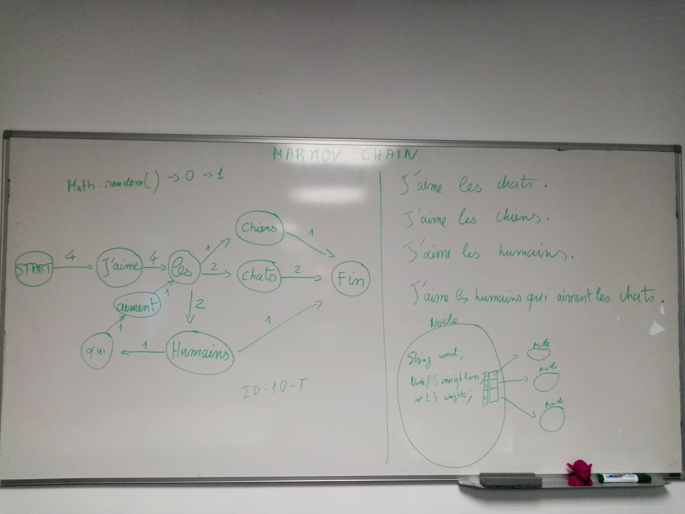

# markov
A Markov chain implementation in Java

The goal is to load a bunch of sentences into a Markov chain structure then
use the structure as a sequence generator.

This is an example of what loading a few similar sentences should achieve in
memory:

Once the sentence dataset is loaded, using the edge weights we can pick random next tokens with probabilistic transitions.
